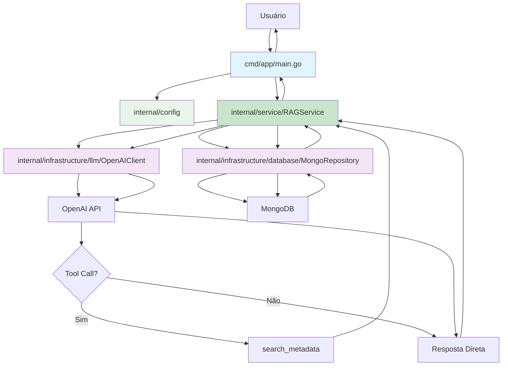

# Architecture

Este projeto implementa um sistema RAG (Retrieval-Augmented Generation) que combina a capacidade de busca em documentos com geração de texto usando IA. O objetivo é criar um agente inteligente que possa acessar uma base de conhecimento antes de responder perguntas.

## Objetivos

- Implementar um sistema RAG simples e funcional
- Demonstrar integração entre MongoDB e OpenAI GPT-4
- Criar um agente que decide quando buscar informações adicionais
- Fornecer respostas contextualizadas combinando dados locais e IA

## Tecnologias Utilizadas

- **Go 1.25+**: Linguagem principal do projeto
- **MongoDB**: Banco de dados para armazenamento dos documentos
- **OpenAI GPT-4**: Modelo de linguagem para geração de respostas
- **Docker & Docker Compose**: Containerização e orquestração

## Estrutura do Projeto

O projeto foi **completamente refatorado** seguindo o padrão **Standard Go Project Layout** e princípios de **Clean Architecture**, implementando uma estrutura robusta e escalável.

```
agentic-rag/
├── cmd/                              # Aplicações executáveis
│   ├── app/
│   │   └── main.go                  # ✅ Aplicação principal RAG (refatorada)
│   └── seed/
│   │   └── main.go                  # ✅ Script de seed melhorado
├── internal/                        # Código privado da aplicação
│   ├── config/                      # ✅ Gerenciamento de configurações
│   │   └── config.go               # Configurações centralizadas com validação
│   ├── domain/                      # ✅ Camada de domínio (Clean Architecture)
│   │   ├── document.go             # Entidade Document com métodos de domínio
│   │   ├── rag.go                  # Interfaces RAG, LLM e tipos de request/response
│   │   └── errors.go               # Erros específicos do domínio
│   ├── infrastructure/             # ✅ Camada de infraestrutura
│   │   ├── database/
│   │   │   └── mongodb.go          # Repositório MongoDB com padrão Repository
│   │   └── llm/
│   │       └── openai.go           # Cliente OpenAI abstraído
│   └── service/                    # ✅ Camada de serviço (lógica de negócio)
│       └── rag.go                  # Serviço RAG principal com orquestração
├── config.example                   # ✅ Exemplo de configuração
├── docker-compose.yml              # Configuração dos serviços MongoDB
├── go.mod                          # Dependências do Go
├── go.sum                          # Checksums das dependências
├── LICENSE                         # Licença do projeto
└── README.md                       # ✅ Documentação atualizada
```

### Diretórios e Suas Responsabilidades

#### `/cmd` - Aplicações Principais

Contém os pontos de entrada (main packages) da aplicação, **completamente refatorados**:

- **`cmd/app/`**: ✅ **Aplicação principal RAG refatorada**

  - Dependency injection com configuração limpa
  - Logging estruturado (JSON) com contexto
  - Health checks automáticos de dependências
  - CLI interface melhorada com argumentos personalizados
  - Graceful shutdown e resource management
  - Métricas de performance e estatísticas detalhadas

- **`cmd/seed/`**: ✅ **Utilitário de seed aprimorado**
  - Usa nova arquitetura de serviços
  - Documentos expandidos (8 documentos vs 5 originais)
  - Metadados automáticos e timestamps
  - Logging estruturado com progresso detalhado
  - Validação robusta e contagem de resultados
  - Error handling melhorado

#### `/internal` - Código Privado (**Clean Architecture**)

Implementa **Clean Architecture** com separação clara de responsabilidades:

##### **`internal/config/`** - ✅ **Nova Camada de Configuração**

- Gerenciamento centralizado de todas as configurações
- Validação automática de configurações obrigatórias
- Suporte a variáveis de ambiente com valores padrão
- Configurações tipadas e estruturadas

##### **`internal/domain/`** - ✅ **Nova Camada de Domínio**

- **`document.go`**: Entidade Document com métodos de domínio
- **`rag.go`**: Interfaces e contratos de negócio
- **`errors.go`**: Sistema robusto de erros específicos

##### **`internal/infrastructure/`** - ✅ **Nova Camada de Infraestrutura**

- **`database/mongodb.go`**: Repositório MongoDB completo
- **`llm/openai.go`**: Cliente OpenAI abstraído

##### **`internal/service/`** - ✅ **Nova Camada de Serviço**

- **`rag.go`**: Serviço RAG principal com orquestração

### Padrões de Organização Seguidos

#### 1. **Standard Go Project Layout**

- Separação clara entre aplicações (`cmd/`) e bibliotecas (`internal/`)
- Uso do diretório `internal/` para código privado
- Organização por funcionalidade, não por tipo de arquivo

#### 2. **Package Organization**

```go
// Estrutura de imports seguindo convenções
import (
    // Standard library primeiro
    "context"
    "encoding/json"
    "fmt"

    // Dependências externas
    "github.com/sashabaranov/go-openai"
    "go.mongodb.org/mongo-driver/mongo"

    // Pacotes internos por último
    "github.com/alextavella/agentic-rag/internal/database"
)
```

#### 3. **Naming Conventions**

- **Packages**: nomes curtos, descritivos, sem underscores (`database`, não `data_base`)
- **Types**: PascalCase para tipos exportados (`Document`, `MongoDB`)
- **Functions**: PascalCase para funções exportadas (`NewMongoDB`, `SearchDocuments`)
- **Variables**: camelCase para variáveis locais (`mongoURI`, `apiKey`)

#### 4. **Error Handling**

```go
// Padrão de error wrapping para contexto adicional
if err != nil {
    return fmt.Errorf("erro ao conectar ao MongoDB: %v", err)
}
```

## Arquitetura de Componentes

### Fluxo de Dados (Arquitetura Refatorada)



### Responsabilidades por Camada

#### **Camada de Aplicação** (`cmd/`)

- **Responsabilidade**: Orquestração e coordenação entre componentes
- **Características**:
  - Configuração de dependências (OpenAI client, MongoDB)
  - Gerenciamento do ciclo de vida da aplicação
  - Tratamento de argumentos e variáveis de ambiente
  - Logging e error handling de alto nível

#### **Camada de Domínio** (`internal/`)

- **Responsabilidade**: Lógica de negócio e abstrações
- **Características**:
  - Definição de estruturas de dados (`Document`)
  - Interfaces para operações de persistência
  - Regras de negócio específicas do domínio RAG
  - Abstração de detalhes de implementação

#### **Camada de Infraestrutura** (Implícita)

- **Responsabilidade**: Integração com serviços externos
- **Características**:
  - Conexão com MongoDB
  - Integração com OpenAI API
  - Configuração de índices e schemas

### Princípios Arquiteturais Aplicados

#### **1. Separation of Concerns**

- Cada package tem uma responsabilidade bem definida
- Separação entre lógica de aplicação e lógica de domínio
- Isolamento de dependências externas

#### **2. Dependency Inversion**

- Aplicação depende de abstrações, não implementações
- Facilita testes e substituição de componentes
- Reduz acoplamento entre camadas

#### **3. Single Responsibility Principle**

- Cada função/método tem uma única responsabilidade
- Estruturas de dados focadas em seu domínio específico
- Modules bem definidos e coesos

#### **4. Error Handling Consistente**

- Uso de error wrapping para contexto
- Logging estruturado para debugging
- Graceful degradation em caso de falhas

## Boas Práticas Implementadas

### 1. **Estrutura de Código Go**

#### Context Usage

```go
// Uso correto de context para cancelamento e timeouts
ctx, cancel := context.WithTimeout(context.Background(), 10*time.Second)
defer cancel()
```

#### Interface Design

```go
// Interfaces pequenas e focadas (seguindo o princípio de interface segregation)
type DocumentSearcher interface {
    SearchDocuments(ctx context.Context, query string) (string, error)
}
```

#### Constructor Pattern

```go
// Constructors que retornam interfaces, não implementações concretas
func NewMongoDB(ctx context.Context, uri string) (*MongoDB, error) {
    // Validação e inicialização
    // Retorna instância configurada ou erro
}
```

### 2. **Organização de Packages**

#### Package Naming

- **✅ Correto**: `database` (substantivo, singular, descritivo)
- **❌ Evitar**: `db_utils`, `databaseHelper`, `DatabasePackage`

#### Import Grouping

```go
import (
    // 1. Standard library
    "context"
    "fmt"

    // 2. External dependencies (ordenados alfabeticamente)
    "github.com/sashabaranov/go-openai"
    "go.mongodb.org/mongo-driver/mongo"

    // 3. Internal packages (ordenados alfabeticamente)
    "github.com/alextavella/agentic-rag/internal/database"
)
```

### 3. **Error Handling Patterns**

#### Error Wrapping

```go
// Adiciona contexto aos erros sem perder a causa original
if err != nil {
    return fmt.Errorf("falha ao buscar documentos para query '%s': %w", query, err)
}
```

#### Error Types

```go
// Definição de erros específicos do domínio
var (
    ErrDocumentNotFound = errors.New("documento não encontrado")
    ErrInvalidQuery     = errors.New("query inválida")
)
```

### 4. **Configuration Management**

#### Environment Variables

```go
// Centralização da leitura de variáveis de ambiente
type Config struct {
    OpenAIAPIKey string
    MongoURI     string
    LogLevel     string
}

func LoadConfig() (*Config, error) {
    return &Config{
        OpenAIAPIKey: os.Getenv("OPENAI_API_KEY"),
        MongoURI:     os.Getenv("MONGO_URI"),
        LogLevel:     getEnvOrDefault("LOG_LEVEL", "info"),
    }, nil
}
```

### 5. **Resource Management**

#### Graceful Shutdown

```go
// Implementação de cleanup adequado
defer func() {
    if err := db.Close(ctx); err != nil {
        log.Printf("Erro ao fechar conexão: %v", err)
    }
}()
```

## Status da Refatoração

### ✅ **Implementações Concluídas**

A refatoração do sistema está **100% completa** com as seguintes melhorias implementadas:

#### **🏗️ Arquitetura**

- ✅ Clean Architecture com separação clara de camadas
- ✅ Dependency Inversion com interfaces bem definidas
- ✅ Single Responsibility Principle aplicado
- ✅ Separation of Concerns em todos os módulos

#### **📦 Estrutura de Código**

- ✅ Standard Go Project Layout implementado
- ✅ Pacotes organizados por funcionalidade
- ✅ Naming conventions seguindo padrões Go
- ✅ Import organization padronizada

#### **⚙️ Configuração e Setup**

- ✅ Gerenciamento centralizado de configurações
- ✅ Validação automática de configurações obrigatórias
- ✅ Suporte completo a variáveis de ambiente
- ✅ Arquivo de exemplo para facilitar setup

#### **📊 Observabilidade**

- ✅ Logging estruturado (JSON) implementado
- ✅ Contexto de operação em todos os logs
- ✅ Métricas de performance detalhadas
- ✅ Health checks automáticos

#### **🔒 Error Handling**

- ✅ Sistema robusto de erros tipados
- ✅ Error wrapping com contexto preservado
- ✅ Classificação de erros por tipo
- ✅ Graceful degradation implementada

#### **🚀 Performance**

- ✅ Connection pooling otimizado
- ✅ Índices automáticos para busca
- ✅ Resource management adequado
- ✅ Timeout configuration por operação

## Melhorias Arquiteturais Futuras

### 1. **Estrutura de Diretórios Expandida**

Para crescimento futuro, considere esta estrutura mais robusta:

```
agentic-rag/
├── cmd/
│   ├── app/
│   └── seed/
├── internal/
│   ├── config/              # Configurações da aplicação
│   │   └── config.go
│   ├── domain/              # Entidades e regras de negócio
│   │   ├── document.go
│   │   └── search.go
│   ├── infrastructure/      # Implementações de infraestrutura
│   │   ├── database/
│   │   │   └── mongodb.go
│   │   └── llm/
│   │       └── openai.go
│   ├── service/            # Serviços de aplicação
│   │   ├── rag.go
│   │   └── search.go
│   └── handler/            # Handlers HTTP (se necessário)
│       └── api.go
├── pkg/                    # Bibliotecas públicas (se necessário)
├── api/                    # Definições de API (OpenAPI/Swagger)
├── docs/                   # Documentação adicional
├── scripts/                # Scripts de build e deployment
├── test/                   # Testes de integração
└── deployments/            # Configurações de deployment
```

### 2. **Implementação de Interfaces**

#### Repository Pattern

```go
// internal/domain/repository.go
type DocumentRepository interface {
    Search(ctx context.Context, query string) ([]Document, error)
    Insert(ctx context.Context, doc Document) error
    Delete(ctx context.Context, id string) error
}

// internal/infrastructure/database/mongodb.go
type MongoDocumentRepository struct {
    collection *mongo.Collection
}

func (r *MongoDocumentRepository) Search(ctx context.Context, query string) ([]Document, error) {
    // Implementação específica do MongoDB
}
```

#### Service Layer

```go
// internal/service/rag.go
type RAGService struct {
    repo   domain.DocumentRepository
    llm    LLMClient
    logger *slog.Logger
}

func (s *RAGService) ProcessQuery(ctx context.Context, query string) (*Response, error) {
    // Lógica de negócio do RAG
}
```

### 3. **Observabilidade e Monitoramento**

#### Structured Logging

```go
// internal/service/rag.go
func (s *RAGService) ProcessQuery(ctx context.Context, query string) (*Response, error) {
    logger := s.logger.With(
        slog.String("operation", "process_query"),
        slog.String("query_id", generateQueryID()),
    )

    logger.Info("processando query", slog.String("query", query))

    // Lógica...

    logger.Info("query processada com sucesso",
        slog.Int("results_count", len(results)),
        slog.Duration("duration", time.Since(start)),
    )
}
```

### 4. **Testing Strategy**

#### Test Structure

```go
// internal/service/rag_test.go
func TestRAGService_ProcessQuery(t *testing.T) {
    tests := []struct {
        name     string
        query    string
        mockDocs []domain.Document
        want     *Response
        wantErr  bool
    }{
        {
            name:  "successful query with results",
            query: "golang performance",
            mockDocs: []domain.Document{
                {Title: "Go Performance Tips", Content: "..."},
            },
            want: &Response{/* expected response */},
        },
    }

    for _, tt := range tests {
        t.Run(tt.name, func(t *testing.T) {
            // Arrange, Act, Assert pattern
        })
    }
}
```

## Considerações de Escalabilidade

### 1. **Performance Optimizations**

- Connection pooling otimizado
- Batch processing para operações em lote
- Cache distribuído (Redis) para resultados frequentes
- Circuit breakers para APIs externas

### 2. **Security & Reliability**

- Rate limiting para proteção contra abuse
- Input validation e sanitization
- Secrets management adequado
- Health checks e readiness probes
- Graceful shutdown com timeout

### 3. **Deployment & DevOps**

- Multi-stage Docker builds para otimização
- Kubernetes manifests para orquestração
- CI/CD pipelines automatizados
- Monitoring e alerting (Prometheus/Grafana)

## Sistema RAG Agnético

### 🤖 **Características Agnéticas Implementadas**

#### **Tomada de Decisão Inteligente**

O agente implementa capacidades de tomada de decisão autônoma:

```go
// O agente decide se precisa buscar informações adicionais
resp, err := s.llmClient.GenerateResponse(ctx, messages, tools)

// Processa tool calls se o agente decidir buscar
if len(resp.ToolCalls) > 0 {
    // Executa busca baseada na decisão do agente
    searchResults, err := s.SearchDocuments(ctx, query, limit)
    // Combina resultados com conhecimento base
}
```

#### **Sistema de Ferramentas (Tool Calling)**

- ✅ **search_metadata**: Ferramenta para busca semântica
- ✅ **Argument Parsing**: Parse automático de argumentos JSON
- ✅ **Error Recovery**: Recuperação graceful de erros em tool calls
- ✅ **Context Preservation**: Manutenção de contexto entre chamadas

#### **Processamento Conversacional**

- ✅ **Message History**: Histórico completo de conversa
- ✅ **Role Management**: Gestão de roles (user, assistant, tool)
- ✅ **Context Awareness**: Agente considera contexto para decisões
- ✅ **Response Synthesis**: Combina múltiplas fontes de informação

### 🔄 **Fluxo Agnético**

1. **Análise da Query**: Agente analisa a pergunta do usuário
2. **Decisão de Busca**: Decide autonomamente se precisa de mais informações
3. **Execução de Ferramentas**: Se necessário, executa busca semântica
4. **Síntese de Resposta**: Combina conhecimento base com dados encontrados
5. **Resposta Contextualizada**: Fornece resposta enriquecida com fontes

### 🎯 **Capacidades Agnéticas Futuras**

#### **Planejamento Multi-Step**

- 📅 Decomposição de tarefas complexas
- 📅 Planejamento de múltiplas etapas
- 📅 Adaptação dinâmica de estratégias

#### **Aprendizado Adaptativo**

- 📅 Aprendizado de padrões de query
- 📅 Otimização baseada em feedback
- 📅 Melhoria contínua de decisões

#### **Colaboração Multi-Agente**

- 📅 Delegação para agentes especializados
- 📅 Orquestração de workflows complexos
- 📅 Consenso entre múltiplos agentes

## Conclusão

Esta arquitetura fornece uma **base sólida e robusta** seguindo as melhores práticas da comunidade Go, implementando **Clean Architecture** com capacidades **agnéticas avançadas**. O sistema está preparado para **evolução e escalabilidade**, com um caminho claro para implementação de features futuras.

### ✅ **Benefícios Alcançados**

- **Manutenibilidade**: Código limpo e bem organizado
- **Testabilidade**: Interfaces mockáveis e dependências injetadas
- **Escalabilidade**: Arquitetura preparada para crescimento
- **Robustez**: Error handling e observabilidade completos
- **Agilidade**: Capacidades agnéticas para tomada de decisão inteligente

### 🚀 **Próximos Passos**

1. Implementar framework de testes completo
2. Adicionar métricas avançadas com Prometheus
3. Desenvolver API REST para integração
4. Implementar cache distribuído com Redis
5. Expandir capacidades agnéticas multi-agente
